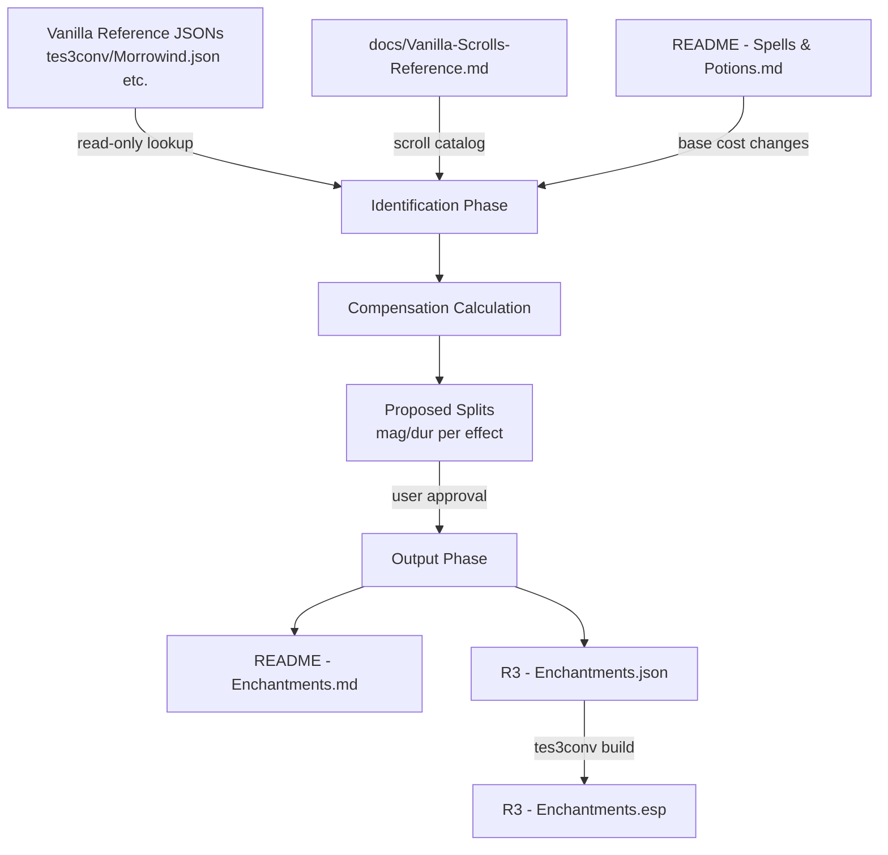

# Design Document: Scroll Rebalance

## Overview

This feature systematically identifies and rebalances scrolls whose enchantment effects had their base costs reduced by ×5 or ×10 in the R3 mod. When a base cost is reduced, the effective spell cost drops proportionally — compensation scaling on magnitudes/durations restores the original power budget. Scrolls have not yet received this treatment, so they currently feel underpowered relative to rebalanced spells.

The system processes scrolls from Morrowind.esm, Tribunal.esm, and Bloodmoon.esm, applies the appropriate compensation factor (×5 or ×10) to magnitude×duration products, enforces the rounding rule, and outputs changes to both `README - Enchantments.md` and `R3 - Enchantments.json`.

### Affected Scrolls (Research Summary)

From the Vanilla Scrolls Reference and cross-referencing with R3 base cost changes:

**×10 Effects (Burden, Feather, Drain Magicka, Drain Fatigue, Disintegrate Armor):**

| Scroll | Effect | Vanilla Mag | Vanilla Dur | Factor |
|--------|--------|-------------|-------------|--------|
| Scroll of Ulm Juiceda's Feather | Feather | 50 | 240s | ×10 |
| Scroll of Fader's Leaden Flesh | Burden | 0-50 | 30s | ×10 |
| Scroll of Baleful Suffering | Burden | 0-25 | 30s | ×10 |
| Scroll of Baleful Suffering | Disintegrate Armor | 5 | 5s | ×10 |

**×5 Effects (Disintegrate Weapon, Detect Animal, Detect Enchantment, Detect Key):**

| Scroll | Effect | Vanilla Mag | Vanilla Dur | Factor |
|--------|--------|-------------|-------------|--------|
| Scroll of Baleful Suffering | Disintegrate Weapon | 5 | 5s | ×5 |
| Scroll of Reynos' Beast Finder | Detect Animal | 40-80 | 10s | ×5 |
| Scroll of The Mage's Eye | Detect Enchantment | 40-80 | 10s | ×5 |
| Scroll of Tevral's Hawkshaw | Detect Key | 40-80 | 30s | ×5 |

**Already processed in R3 - Enchantments.json:**
- Scroll of Fader's Leaden Flesh (Burden ×10): `0-50/30s -> 0-250/60s`
- Scroll of Baleful Suffering: only Burden effect listed in README currently (unchanged at `0-25/30s`), but the JSON record exists with vanilla values for all effects

**Not yet processed:**
- Scroll of Ulm Juiceda's Feather (Feather ×10)
- Scroll of Reynos' Beast Finder (Detect Animal ×5)
- Scroll of The Mage's Eye (Detect Enchantment ×5)
- Scroll of Tevral's Hawkshaw (Detect Key ×5)
- Scroll of Baleful Suffering — DisArmor (×10) and DisWeapon (×5) effects still at vanilla values

### Design Decisions

1. **Magnitude-first scaling**: When applying the compensation factor to `mag×dur`, prefer increasing magnitude over duration where possible, since scrolls are one-use items and higher magnitude with shorter duration feels more impactful for a single cast. Duration increases are used when magnitude would exceed reasonable bounds or violate rounding.

2. **Existing entries preserved**: Scroll of Fader's Leaden Flesh already has an approved split (`0-250/60s`). The system will not re-propose values for already-processed scrolls unless explicitly asked.

3. **Multi-effect coherence**: Scroll of Baleful Suffering has 6 effects with 3 different scale factors (Burden ×10, DisArmor ×10, DisWeapon ×5, and Blind/Demoralize unchanged). Each effect is scaled independently per Requirement 6.4.

4. **No-Scale Effects**: Fire/Frost/Shock Damage and Poison on scrolls keep vanilla magnitudes — only rounding fixes apply. None of the identified High_Scale_Effect scrolls contain these effects.

---

## Architecture

The scroll rebalance system is a **manual workflow assisted by Kiro**, not a standalone tool. The architecture is:



### Processing Pipeline

1. **Identify**: Cross-reference scroll enchantments against the High_Scale_Effects list
2. **Calculate**: For each High_Scale_Effect on a scroll, compute `vanilla_mag × vanilla_dur × factor` to get the target product
3. **Propose Split**: Find a `(new_mag, new_dur)` pair where `new_mag × new_dur = target_product`, `new_mag` satisfies rounding rule, and both are positive integers
4. **Review**: Present all effects (scaled and unchanged) for user approval
5. **Output**: Write approved values to README and JSON

---

## Components and Interfaces

### Component 1: Scroll Identifier

**Responsibility**: Scan vanilla reference data to find scrolls using High_Scale_Effects.

**Inputs**:
- Vanilla Scrolls Reference (docs/Vanilla-Scrolls-Reference.md)
- High_Scale_Effects list with compensation factors

**Outputs**:
- List of affected scrolls with their effect details and applicable factors

### Component 2: Compensation Calculator

**Responsibility**: Compute scaled magnitude×duration products and propose valid splits.

**Interface**:
```
Input:  (min_mag, max_mag, duration, factor)
Output: (new_min_mag, new_max_mag, new_duration)
```

**Algorithm**:
1. Compute target products: `min_product = min_mag × duration × factor`, `max_product = max_mag × duration × factor`
2. Choose a duration that divides both products evenly (prefer original duration or small multiples)
3. Compute `new_min_mag = min_product / new_duration`, `new_max_mag = max_product / new_duration`
4. Apply rounding rule to magnitudes
5. If rounding breaks the product equality, adjust duration to compensate or flag for manual review

**Rounding Rule**:
- Magnitude must be 1 or a multiple of 5
- Value 2 → round to 1 (nearest valid value)
- Values 3-4 → round to 5
- Values > 5 not divisible by 5 → round to nearest multiple of 5 (standard rounding: .5 rounds up)

### Component 3: Spell Cost Calculator

**Responsibility**: Calculate effective spell cost for price comparison.

**Formula**:
- OnSelf / OnTouch: `(min + max) × duration × (base_cost / 40) + area × (base_cost / 40)`
- OnTarget: `((min + max) × duration × (base_cost / 40) + area × (base_cost / 40)) × 1.5`

For multi-effect enchantments, sum each effect's cost individually.

### Component 4: Output Formatter

**Responsibility**: Write changes to README and JSON in the correct format.

**README format** (per spell-edit-workflow):
- Column 0: scroll name
- Column 44: magnitude/duration values (`vanilla -> new`)
- Column 76: comments and `id:` tag

**JSON format**: Standard tes3conv Enchanting record with updated `min_magnitude`, `max_magnitude`, `duration` fields.

---

## Data Models

### High_Scale_Effect Entry

| Field | Type | Description |
|-------|------|-------------|
| effect_name | string | Magic effect identifier (e.g., "Burden", "Feather") |
| tes3_effect_id | string | tes3conv effect enum (e.g., "Burden", "Feather", "DrainMagicka") |
| old_base_cost | float | Vanilla base cost |
| new_base_cost | float | R3 base cost |
| compensation_factor | int | ×5 or ×10 multiplier for mag×dur |

### Scroll Effect Record

| Field | Type | Description |
|-------|------|-------------|
| scroll_name | string | Display name of the scroll |
| scroll_id | string | Item record ID (e.g., "sc_ulmjuicedasfeather") |
| enchantment_id | string | Enchantment record ID (typically `{scroll_id}_en`) |
| effect_name | string | Magic effect name |
| range | enum | OnSelf, OnTouch, OnTarget |
| area | int | Area of effect in feet |
| vanilla_min_mag | int | Original minimum magnitude |
| vanilla_max_mag | int | Original maximum magnitude |
| vanilla_duration | int | Original duration in seconds |
| compensation_factor | int | 5 or 10 |
| proposed_min_mag | int | New minimum magnitude (after scaling + rounding) |
| proposed_max_mag | int | New maximum magnitude (after scaling + rounding) |
| proposed_duration | int | New duration |

### Enchantment JSON Record Structure

```json
{
    "type": "Enchanting",
    "flags": "",
    "id": "sc_ulmjuicedasfeather_en",
    "effects": [
        {
            "magic_effect": "Feather",
            "skill": "None",
            "attribute": "None",
            "range": "OnSelf",
            "area": 0,
            "duration": 240,
            "min_magnitude": 50,
            "max_magnitude": 50
        }
    ],
    "data": {
        "enchant_type": "CastOnce",
        "cost": 30,
        "max_charge": 30,
        "flags": "AUTO_CALCULATE"
    }
}
```

### Compensation Factor Table

| Effect | Old Base Cost | New Base Cost | Ratio | Factor |
|--------|--------------|---------------|-------|--------|
| Burden | 1 | 0.1 | ÷10 | ×10 |
| Feather | 1 | 0.1 | ÷10 | ×10 |
| Drain Magicka | 4 | 0.4 | ÷10 | ×10 |
| Drain Fatigue | 2 | 0.2 | ÷10 | ×10 |
| Disintegrate Armor | 6 | 0.6 | ÷10 | ×10 |
| Disintegrate Weapon | 6 | 1.2 | ÷5 | ×5 |
| Detect Animal | 0.75 | 0.15 | ÷5 | ×5 |
| Detect Enchantment | 1 | 0.2 | ÷5 | ×5 |
| Detect Key | 1 | 0.2 | ÷5 | ×5 |


---

## Correctness Properties

*A property is a characteristic or behavior that should hold true across all valid executions of a system — essentially, a formal statement about what the system should do. Properties serve as the bridge between human-readable specifications and machine-verifiable correctness guarantees.*

### Property 1: Scroll filter returns exactly the High_Scale_Effect scrolls

*For any* collection of scroll enchantment records, the filter function SHALL return exactly those scrolls containing at least one effect in the High_Scale_Effects set, and SHALL exclude all scrolls that contain no High_Scale_Effects. Furthermore, for each returned scroll, only effects that are High_Scale_Effects SHALL be marked for compensation.

**Validates: Requirements 1.1, 1.3, 1.4**

### Property 2: Rounding function produces valid magnitudes

*For any* positive integer magnitude value, the rounding function SHALL produce a result that is either 1 or a multiple of 5. Specifically: value 2 maps to 1, values 3-4 map to 5, values above 5 map to the nearest multiple of 5 (standard rounding), and values that are already 1 or a multiple of 5 are unchanged.

**Validates: Requirements 2.1, 2.4, 2.5**

### Property 3: Spell cost formula correctness

*For any* valid effect parameters (min_magnitude, max_magnitude, duration, area, base_cost, range_type), the spell cost calculator SHALL produce a result equal to `(min + max) × duration × (base_cost / 40) + area × (base_cost / 40)` for OnSelf/OnTouch, or that value multiplied by 1.5 for OnTarget. For multi-effect enchantments the total cost SHALL equal the sum of individual effect costs.

**Validates: Requirements 3.2, 6.3**

### Property 4: Price deviation flag triggers correctly

*For any* scroll with a gold price and a computed effective spell cost, the price review flag SHALL be set if and only if `|price - spell_cost| / spell_cost > 0.5`.

**Validates: Requirements 3.5**

### Property 5: Compensation scaling preserves the target product

*For any* effect with (min_mag, max_mag, duration) and compensation factor F (5 or 10), the scaled output (new_min_mag, new_max_mag, new_duration) SHALL satisfy `new_min_mag × new_duration ≈ min_mag × duration × F` and `new_max_mag × new_duration ≈ max_mag × duration × F`, where the approximation accounts for rounding adjustments to magnitudes.

**Validates: Requirements 4.1, 4.2**

### Property 6: Post-scaling magnitudes satisfy the rounding rule

*For any* effect after compensation scaling is applied, the resulting min_magnitude and max_magnitude SHALL each be either 1 or a multiple of 5.

**Validates: Requirements 4.3**

### Property 7: Split validation accepts valid splits and rejects invalid ones

*For any* proposed (magnitude, duration) split and a target product, the validation function SHALL accept the split if and only if: (a) magnitude × duration equals the target product, (b) magnitude is 1 or a multiple of 5, and (c) both magnitude and duration are positive integers.

**Validates: Requirements 4.5, 4.6, 4.7**

### Property 8: Record IDs are never modified

*For any* scroll enchantment record processed by the system, the output record's `id` field SHALL be identical to the input record's `id` field, and the scroll's item ID and enchantment ID SHALL remain unchanged.

**Validates: Requirements 5.5, 7.1, 7.2**

### Property 9: Effect list structure is preserved

*For any* enchantment record processed by the system, the output SHALL have the same number of effects in the same order, with each effect preserving its original `magic_effect`, `range`, `area`, `skill`, and `attribute` fields. Only `min_magnitude`, `max_magnitude`, and `duration` may differ.

**Validates: Requirements 7.4, 5.6**

### Property 10: README entries have correct column alignment

*For any* scroll entry rendered to README format, the scroll name SHALL start at column 0, the magnitude/duration values SHALL start at column 44, and the `id:` comment SHALL start at column 76.

**Validates: Requirements 5.1, 5.3**

---

## Error Handling

| Error Condition | Handling Strategy |
|----------------|-------------------|
| Scroll enchantment not found in vanilla JSON | Report missing record with scroll ID; skip processing for that scroll |
| Compensation produces magnitude < 1 | Floor to 1 (minimum magnitude) |
| Compensation produces non-integer duration | Round duration to nearest integer; flag for manual review if product deviation > 5% |
| User provides invalid split (product mismatch) | Reject with message: "magnitude × duration ({actual}) does not equal required product ({expected})" |
| User provides invalid split (rounding violation) | Reject with message: "magnitude {value} violates rounding rule (must be 1 or multiple of 5)" |
| Multi-effect scroll has mixed factors > 5× ratio | Flag for manual review per Requirement 6.4 |
| Enchantment record already exists in R3 JSON | Update in place rather than duplicating |
| min_magnitude is 0 (e.g., Burden 0-25) | Keep min at 0 after scaling (0 × factor = 0); only max_magnitude is scaled |

---

## Testing Strategy

### Property-Based Tests

This feature is well-suited for property-based testing because the core logic consists of pure mathematical functions (rounding, scaling, formula calculation, validation) with clear universal properties across a wide input space.

**Library**: fast-check (JavaScript/TypeScript) or Hypothesis (Python) — depending on implementation language. Since this is a data-processing workflow without a runtime codebase, properties are specified for validation during the manual review process.

**Configuration**: Minimum 100 iterations per property test.

**Tag format**: `Feature: scroll-rebalance, Property {number}: {property_text}`

### Unit Tests (Example-Based)

| Test Case | Input | Expected Output |
|-----------|-------|-----------------|
| Feather scroll ×10 | mag=50, dur=240, factor=10 | product=120000, proposed: mag=500/dur=240 or mag=250/dur=480 etc. |
| Detect Key ×5 | mag=40-80, dur=30, factor=5 | product_min=6000, product_max=12000 |
| Rounding: value 2 | 2 | 1 |
| Rounding: value 3 | 3 | 5 |
| Rounding: value 7 | 7 | 5 |
| Rounding: value 8 | 8 | 10 |
| Rounding: value 50 | 50 | 50 (unchanged) |
| Rounding: value 1 | 1 | 1 (unchanged) |
| Invalid split rejection | mag=7, dur=10, target=70 | Reject: magnitude 7 violates rounding |
| Valid split acceptance | mag=50, dur=10, target=500 | Accept |
| Price flag: 50% over | price=150, cost=100 | Flag (50% deviation) |
| Price flag: within range | price=120, cost=100 | No flag (20% deviation) |

### Integration Tests

| Test Case | Description |
|-----------|-------------|
| Copy from vanilla JSON | Verify enchantment record is correctly copied from tes3conv/Morrowind.json when not present in R3 JSON |
| README + JSON sync | Verify that after processing, README entries and JSON records contain matching values |
| ESP build | Verify tes3conv successfully converts the updated JSON to a valid ESP file |

### Edge Cases

- Scroll with min_magnitude = 0 (Burden 0-25): min stays 0, only max is scaled
- Scroll with magnitude = 1: after ×10 scaling → 10, which satisfies rounding
- Multi-effect scroll with all effects being High_Scale (theoretical)
- Scroll already partially processed in R3 (Fader's Leaden Flesh, Baleful Suffering)
